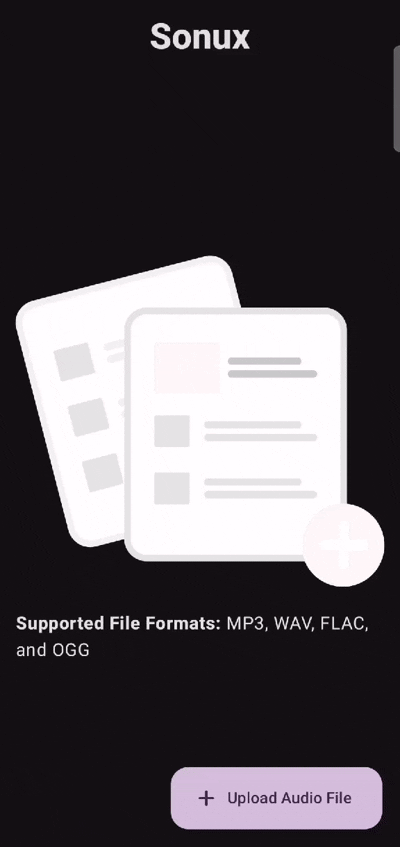

# Sonux

## Overview

Sonux is a Kotlin Multiplatform [KMP] project that converts an audio into its 8D form using the FFMPEG Library...

  

## Table of Contents

1. [Background](#Background)
2. [Architecture](#Architecture)
3. [Tests](#Tests)
4. [Screenshots](#Screenshots)
5. [Credits](#Credits)
6. [Trivia](#Trivia)
7. [Future](#Future)

## Background

- The Sonux Project was forged as a spin-off to [Carizma](https://github.com/emmanuelmuturia/Carizma) with the main objective being researching [The 8D Effect](https://www.epidemicsound.com/blog/8d-audio-what-is-it-and-whats-the-hype-all-about/)...
- The initial iteration of The Sonux Project was powered by [MediaPlayer](https://developer.android.com/reference/android/media/MediaPlayer) but the current one relies on [FFmpeg Kit](https://github.com/arthenica/ffmpeg-kit) for Playback Control...
- The Sonux Project was purposed to become an Android Library but has been set as a KMP project for now...

## Architecture

This is a Kotlin Multiplatform project targeting Android, Desktop, Server.

* `/composeApp` is for code that will be shared across your Compose Multiplatform applications.
  It contains several subfolders:
  - `commonMain` is for code that’s common for all targets...
  - Other folders are for Kotlin code that will be compiled for only the platform indicated in the folder name...
    For example, if you want to use Apple’s CoreCrypto for the iOS part of your Kotlin app,
    `iosMain` would be the right folder for such calls...

* `/server` is for the Ktor server application...

* `/shared` is for the code that will be shared between all targets in the project.
  The most important subfolder is `commonMain`. If preferred, you can add code to the platform-specific folders here too...

- Learn more about [Kotlin Multiplatform](https://www.jetbrains.com/help/kotlin-multiplatform-dev/get-started.html)…

## Tests

- The Sonux Project features no Tests as research is currently ongoing regarding Testing in KMP...

## Screenshots

| Screen                  | Dark Mode                                                                       | Light Mode                                                                        |
|-------------------------|---------------------------------------------------------------------------------|-----------------------------------------------------------------------------------|
| The Home Screen         | ![Home Screen [Dark]](/assets/screenshots/home_screen_dark.png)                 | ![Home Screen [Light]](/assets/screenshots/home_screen_light.png)                 |
| The Confirmation Screen | ![Confirmation Screen [Dark]](/assets/screenshots/confirmation_screen_dark.png) | ![Confirmation Screen [Light]](/assets/screenshots/confirmation_screen_light.png) |
| The Results Screen      | ![Results Screen [Dark]](/assets/screenshots/results_screen_dark.png)           | ![Results Screen [Light]](/assets/screenshots/results_screen_light.png)           |

## Credits

- The Sonux Project has been developed and supported by the following Tools, Technologies, and Libraries:

### 1. Kotlin Multiplatform and Compose Multiplatform

- The Sonux Project has been fully built to support the Android and Desktop platforms using [Kotlin Multiplatform](https://www.jetbrains.com/kotlin-multiplatform/) while allowing for the sharing of the User Interface [UI] code across the platforms using [Compose Multiplatform](https://www.jetbrains.com/compose-multiplatform/) that is powered by [Jetpack Compose](https://developer.android.com/compose)...

### 2. Koin

- [Koin](https://insert-koin.io/) has been used for Dependency Injection...

### 3. Voyager

- [Voyager](https://voyager.adriel.cafe/) has been used for Navigation in the context [pun intended] of Kotlin Multiplatform [KMP]...

### 4. ktlint, detekt, and spotless

- [ktlint](https://github.com/JLLeitschuh/ktlint-gradle) and [spotless](https://github.com/diffplug/spotless) has been used to format the code...
- [detekt](https://detekt.dev/) has been used to perform Static Code Analysis...

## Trivia

- The Desktop implementation of The 8D Effect [Audio] is still in progress...

### The Auto Pan Effect

The Auto Pan Effect is an audio effect where sound continuously and automatically shifts to the left or right and is part of The 8D Effect...

## Future

- The Sonux Project is still under construction as research is still ongoing regarding Audio Manipulation in Android among other platforms...